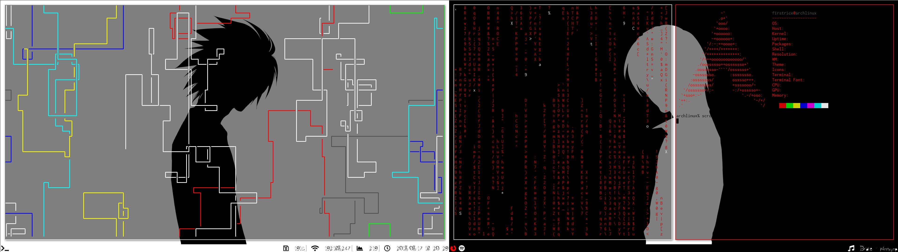

<h1 align="center">Dotfiles - Arch Linux</h1> 

🍙 my AWESOME Arch Linux rice 🍚

<h1 align="center">Showcase</h1>

<h1 align="center">Get started</h1>    
<a href="https://wiki.archlinux.org/index.php/general_recommendations">recommandations</a>

<h1 align="center">Fonts</h1>
<a href="https://github.com/powerline/fonts">Powerline fonts</a>
## By Pascal Canuel
